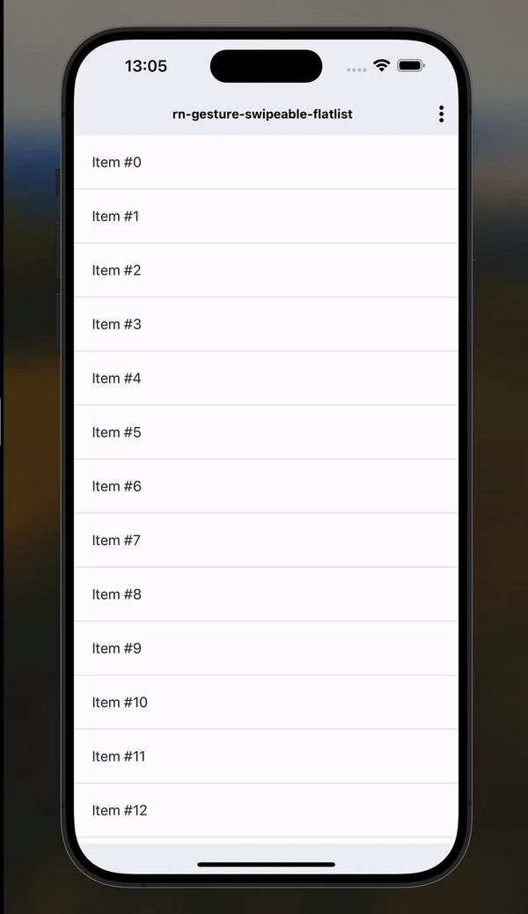

# React Native Swipeable FlatList

<div>
  
</div>

SwipeableFlatList is a custom component that combines the functionality of [FlatList](https://reactnative.dev/docs/flatlist) and [Swipeable](https://docs.swmansion.com/react-native-gesture-handler/docs/api/components/swipeable/) from [React Native]("https://reactnative.dev") and [React Native Gesture Handler](https://docs.swmansion.com/react-native-gesture-handler/docs/) to create a swipeable list. It allows you to easily render a list of items that can be swiped to reveal additional actions.

This package uses usual, core components from both packages listed above - so this should work with any kind of React Native App and should have a high performance on both platforms.

You can also pass additional props supported by FlatList & Swipeable to customize the behavior and appearance of the list.

[Check the example project](https://github.com/GFean/rn-gesture-swipeable-flatlist-example)

## Installation

Install the package & peer dependencies using npm or yarn:

```bash
npm install rn-gesture-swipeable-flatlist
npm install --save react-native-gesture-handler

yarn add rn-gesture-swipeable-flatlist
yarn add react-native-gesture-handler
```
If you are using expo, make sure you install your expo sdk compatible gesture handler version version by running:

```bash
expo install react-native-gesture-handler

```
### Attention
Versions v2.0.0+ should wrap the project root (in App.tsx) in ```GestureHandlerRootView``` from ``` react-native-gesture-handler```.
[Check react-native-gesture-handler installation docs](https://docs.swmansion.com/react-native-gesture-handler/docs/fundamentals/installation)
# Usage 

```jsx
import SwipeableFlatList from 'rn-gesture-swipeable-flatlist';

// Example usage
const MyComponent = () => {
  const data = [...]; // Your data array
  const renderItem = ({ item }) => {
    // Render individual list items
    return (
      // Your list item component JSX
    );
  };

  const renderLeftActions = (item) => {
    // Render left swipe actions for each item
    return (
      // Your left actions component JSX
    );
  };

  const renderRightActions = (item) => {
    // Render right swipe actions for each item
    return (
      // Your right actions component JSX
    );
  };

  return (
    <SwipeableFlatList
      data={data}
      keyExtractor={(item) => item.id}
      renderItem={renderItem}
      renderLeftActions={renderLeftActions}
      renderRightActions={renderRightActions}
    />
  );
};
```

## Props

The SwipeableFlatList component accepts the following props:

### FlatlistProps: 

As the rn-gesture-swipeable-flatlist uses Flatlist from react-native core package, it can be passed FlatlistProps as the usual Flatlist.
Check general FlatlistProps [here](https://github.com/facebook/react-native-website/blob/main/docs/flatlist.md)

### SwipeableProps

As the rn-gesture-swipeable-flatlist uses Swipeable component, it can be passed SwipeableProps, so you can adjust your SwipeableItem of the flatlist.
Check general SwipeableProps [here](https://docs.swmansion.com/react-native-gesture-handler/docs/api/components/swipeable/) 
All the SwipeableProps can be passed under SwipeableProps prop to SwipeableFlatlist:

```jsx
<SwipeableFlatList 
    swipeableProps={{
        enabled: true 
    }}
>
```
### renderLeftActions: ((item: any) => React.ReactNode) | undefined

A function that returns the component to render as left swipe actions for each item. This is actually a SwipeableProp, but for the simplicity, as you will mostly using left/right actions, it can be passed directly to the SwipeableFlatList.

### renderRightActions: ((item: any) => React.ReactNode) | undefined

Similarly to the one above, this is the function that returns the component to render as right swipe actions for each item.
This is also a SwipeableProp, but for the simplicity, as you will mostly using left/right actions, it can be passed directly to the SwipeableFlatList.

### enableOpenMultipleRows:boolean

This is the prop to enable/disable multiple rows being opened. if enabled you can swipe multiple rows and they'll stay open, if disabled - only one row can be opened at a time and the previous one will be closed if you open the new one. Defaults to ```true```. 
(please note, that when you'll alter this prop, you'll need to reinitialize the list - simply refresh the js bundle and the changes will be applied)

### ref: SwipeableFlatListRef
The ref is passed to the base ```Flatlist``` component and you can access all the native api available methods through this. Special interface  ```SwipeableFlatListRef ``` will add a custom module related function to this  ```ref ``` which is   ```closeAnyOpenRows  ``` - see the description below.

## Methods

### closeAnyOpenRows: () => void
SwipeableFlatList provides a method `closeAnyExistingRows()` accessible via a ref to the component. This method can be used to programmatically close any opened rows:

- **When `enableOpenMultipleRows` is true**: The method closes all swipeable rows that are currently open.
- **When `enableOpenMultipleRows` is false**: The method closes the currently open swipeable row, if any.

This method is particularly useful in scenarios where you need to ensure that all swipe actions are reset, such as when navigating away from the list or performing batch actions on the list data.

example usage:

```jsx

   const flatlistRef = useRef<SwipeableFlatListRef<DataItem> | null>(null);
   
   const closeAllOpenRows = () => {
    flatListRef.current?.closeAnyOpenRows();
   };
   
   return (
  <SwipeableFlatList
    ref={flatListRef}
    data={data}
    keyExtractor={(item) => item.id}
    renderItem={renderItem}
    renderLeftActions={renderLeftAction}
    renderRightActions={renderRightAction}
  />
);

```


## Contributing
Contributions are welcome! If you find any issues or would like to suggest improvements, please create a new issue or submit a pull request.

## License
This project is licensed under the [ISC License](https://opensource.org/licenses/ISC).

## Dependencies

- [React Native Gesture Handler](https://github.com/software-mansion/react-native-gesture-handler)

`rn-gesture-swipeable-flatlist` has a peer dependency on `react-native-gesture-handler`. It will be installed automatically when you install this package. However, please ensure that your project meets the requirements for `react-native-gesture-handler`.
