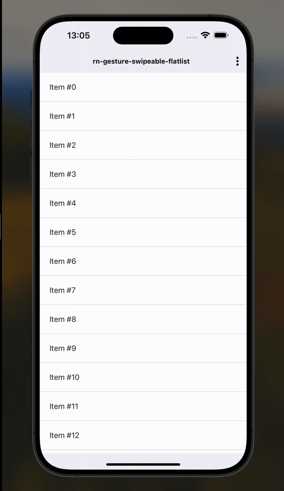

# rn-gesture-swipeable-flatlist

`rn-gesture-swipeable-flatlist` wraps React Native's `FlatList` with `react-native-gesture-handler`'s `Swipeable` so each row can expose left and right swipe actions while still behaving like a normal list.

It supports:

- all regular `FlatList` props
- extra `Swipeable` configuration through `swipeableProps`
- optional `renderLeftActions` / `renderRightActions` helpers bound to each item
- single-open or multi-open row behavior
- an imperative `closeAnyOpenRows()` ref method



## Compatibility

- `react-native-gesture-handler >= 2.10.0`
- React Native `>= 0.71.0`
- React `>= 17.0.0`
- `2.4.x` keeps the current `Swipeable`-based implementation for compatibility with existing apps
- `react-native-reanimated` is not required for `2.4.x`

## Installation

Install the package and its peer dependency:

```bash
npm install rn-gesture-swipeable-flatlist react-native-gesture-handler
```

or:

```bash
yarn add rn-gesture-swipeable-flatlist react-native-gesture-handler
```

If you use Expo, install the Gesture Handler version that matches your SDK:

```bash
expo install react-native-gesture-handler
```

React Native Gesture Handler requires root setup in your app. On current versions, wrap your app root with `GestureHandlerRootView` and follow the official installation guide:

https://docs.swmansion.com/react-native-gesture-handler/docs/fundamentals/installation

## Basic Usage

```tsx
import React from 'react';
import { Text, View } from 'react-native';
import SwipeableFlatList from 'rn-gesture-swipeable-flatlist';

type TodoItem = {
  id: string;
  title: string;
};

const data: TodoItem[] = [
  { id: '1', title: 'Buy milk' },
  { id: '2', title: 'Reply to email' },
];

export function TodoList() {
  return (
    <SwipeableFlatList
      data={data}
      keyExtractor={(item) => item.id}
      renderItem={({ item }) => (
        <View>
          <Text>{item.title}</Text>
        </View>
      )}
      renderLeftActions={(item) => (
        <View>
          <Text>Pin {item.title}</Text>
        </View>
      )}
      renderRightActions={(item) => (
        <View>
          <Text>Delete {item.title}</Text>
        </View>
      )}
    />
  );
}
```

## Ref API

The component forwards the underlying `FlatList` ref and adds one extra method:

- `closeAnyOpenRows(): void`

When `enableOpenMultipleRows` is `true`, it closes every currently open row. When it is `false`, it closes the single tracked open row.

```tsx
import React, { useRef } from 'react';
import { Button } from 'react-native';
import SwipeableFlatList, {
  SwipeableFlatListRef,
} from 'rn-gesture-swipeable-flatlist';

type TodoItem = {
  id: string;
  title: string;
};

export function TodoScreen({ data }: { data: TodoItem[] }) {
  const flatListRef = useRef<SwipeableFlatListRef<TodoItem> | null>(null);

  return (
    <>
      <Button title="Close open rows" onPress={() => flatListRef.current?.closeAnyOpenRows()} />
      <SwipeableFlatList
        ref={flatListRef}
        data={data}
        keyExtractor={(item) => item.id}
        renderItem={({ item }) => null}
      />
    </>
  );
}
```

## Package-Specific Props

`SwipeableFlatList` accepts all `FlatList` props. In addition, it supports:

### `renderLeftActions?: (item) => React.ReactNode`

Convenience helper for the row's left swipe actions.

### `renderRightActions?: (item) => React.ReactNode`

Convenience helper for the row's right swipe actions.

### `swipeableProps?: SwipeableProps`

Additional props forwarded to each `Swipeable` row.

If you pass `renderLeftActions` or `renderRightActions` directly to `SwipeableFlatList`, those values take precedence over the same props inside `swipeableProps`.

### `enableOpenMultipleRows?: boolean`

Controls whether multiple rows can stay open at the same time.

- `true` (default): multiple rows may stay open
- `false`: opening a new row closes the previously open row

This prop can be updated at runtime.

## Key Behavior

Row tracking follows the same priority as `FlatList` keys:

1. `keyExtractor(item, index)` when provided
2. `item.key`
3. `item.id`
4. `index`

For dynamic lists, supply a stable `keyExtractor` whenever possible.

## Notes

- `renderItem` receives the normal `FlatList` item info object, including working `separators`.
- This package depends on `react-native-gesture-handler` as a peer dependency. Install and configure it in your app.
- `2.4.x` still uses Gesture Handler's `Swipeable` under the hood, so existing setups do not need to add Reanimated just to adopt this release.
- For general `FlatList` props, see the React Native docs: https://reactnative.dev/docs/flatlist
- For the underlying `Swipeable` options used by this release, see the Gesture Handler 2.x docs: https://docs.swmansion.com/react-native-gesture-handler/docs/2.x/components/swipeable/

## Example Project

https://github.com/GFean/rn-gesture-swipeable-flatlist-example

## License

ISC
